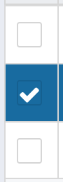
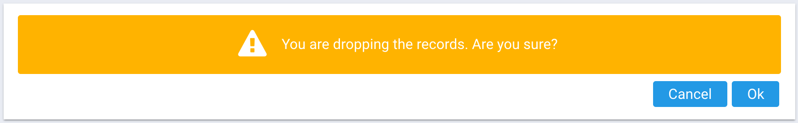
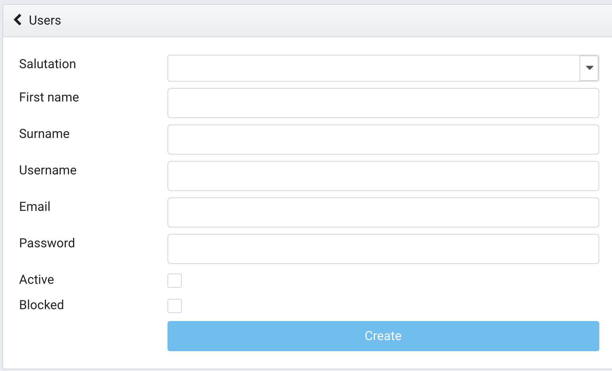

# Customers

## Create the customer
1. Go to **/customers** in your browser;
2. Click on the **create** button from the grid header;  

3. Fill in **all the fields** with the valid data;

4. Click on the **create** button to submit the data.

## Update the customer
1. After creating the new customer you'll see the update customer form. To update the customer from the grid you need to click on the **update** button from the first row;  

2. Сhange the **fields** with the valid data;

3. Click on the **update** button to submit the data.

## Delete the customer
1. Go to **/customers** in your browser;
2. Click on the **delete** button from the first row; 

3. Confirm the deleting of the row. Click on the **ok** button

## Multiple deleting customers
1. Select the customers that you want to remove;  

2. Click on the **delete** button from the grid header;  

3. Confirm the deleting of the rows. Click on the **ok** button

## Create the customer's user
1. Click on the **update** button from the first row;  

3. Select the **tab** with users;  

4. Click on the **create** button to navigate to the form;  

5. Fill in **all the fields** with the valid data;  

6. Click on the **create** button to submit the data.

## Update the customer's user
1. Click on the **update** button from the first row;  

3. Select the **tab** with users;  

4. Click on the **update** button to navigate to the form;  

5. Сhange the **fields** with the valid data;  

6. Click on the **update** button to submit the data.

## Delete the customer's user
1. Click on the **update** button from the first row;  

3. Select the **tab** with users;  

4. Click on the **update** button to navigate to the confirm window;  

3. Confirm the deleting of the row. Click on the **ok** button

## Create the customer's contact
1. Click on the **update** button from the first row;  

3. Select the **tab** with contacts;  

4. Click on the **create** button to navigate to the form;  

5. Fill in **all the fields** with the valid data;  

6. Click on the **create** button to submit the data.

## Update the customer's contact
1. Click on the **update** button from the first row;  

3. Select the **tab** with contacts;  

4. Click on the **update** button to navigate to the form;  

5. Сhange the **fields** with the valid data;  

6. Click on the **update** button to submit the data.

## Delete the customer's contact
1. Click on the **update** button from the first row;  

3. Select the **tab** with contacts;  

4. Click on the **update** button to navigate to the confirm window;  

3. Confirm the deleting of the row. Click on the **ok** button

